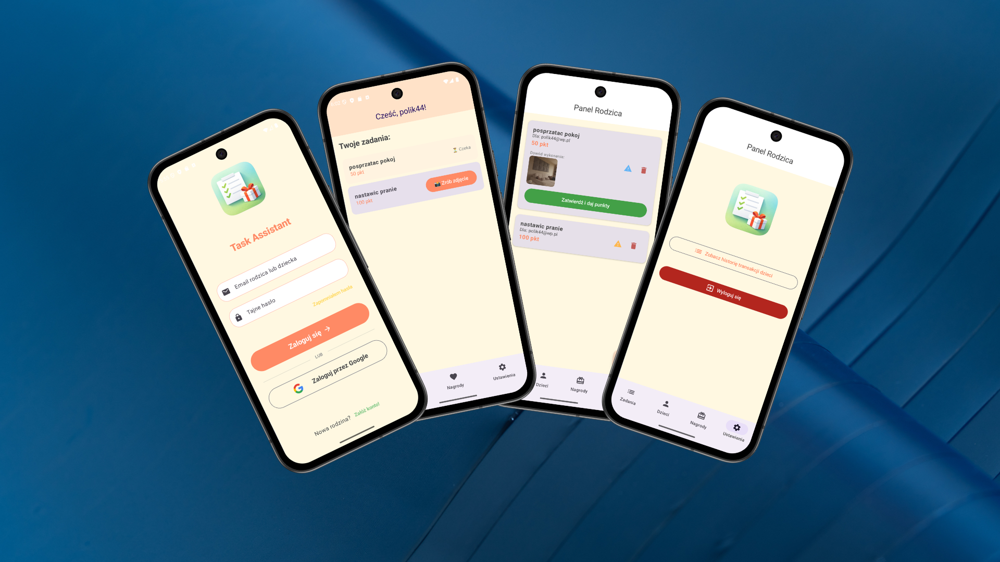

 

  

<h3 align="center">TaskAssistant</h3>

  

    TaskAssistant to aplikacja mobilna na system Android napisana w Kotlinie (Jetpack Compose), która pomaga rodzinom w zarządzaniu obowiązkami domowymi i systemem nagród.
     
     
  

## Wymagania i funkcjonalności (Features)

Aplikacja opiera się na systemie ról: **Rodzic (Admin)** oraz **Dziecko**.

### Autoryzacja i konta:
- Użytkownik może założyć konto z wyborem roli (Rodzic lub Dziecko).
- Użytkownik może logować się za pomocą adresu e-mail i hasła.
- Użytkownik może logować się za pomocą konta Google.
- System zaproszeń: Dziecko może zostać przypisane do konta Rodzica.

### Panel Rodzica (Admin Dashboard):
- Rodzic może dodawać nowe zadania (tytuł, punktacja).
- Rodzic może przypisać zadanie do konkretnego dziecka lub do wszystkich dzieci.
- Rodzic może weryfikować zadania wykonane przez dzieci (podgląd zdjęcia przesłanego jako dowód).
- Rodzic może tworzyć katalog nagród z określoną ceną punktową.
- Rodzic akceptuje prośby dzieci o odebranie nagrody (wydanie nagrody).

### Panel Dziecka (Child Dashboard):
- Dziecko ma podgląd do listy swoich aktualnych zadań.
- Dziecko może oznaczyć zadanie jako wykonane, robiąc zdjęcie dowodowe bezpośrednio w aplikacji (wbudowany aparat).
- Dziecko zbiera punkty za zatwierdzone zadania.
- Dziecko może wymieniać zebrane punkty na nagrody z katalogu.
- Dziecko ma wgląd w swoją historię transakcji i punktów.

### Dodatkowe:
- Aplikacja obsługuje powiadomienia Push (Firebase Cloud Messaging) - np. o nowych zadaniach lub akceptacji nagrody.
- Oparta na nowoczesnej architekturze: MVVM, Jetpack Compose, Kotlin Coroutines, StateFlow.

---
## Technologie i Narzędzia

Aplikacja została zbudowana w oparciu o nowoczesny stos technologiczny rekomendowany przez Google dla systemu Android:

* **Język:** Kotlin
* **Interfejs Użytkownika:** Jetpack Compose, Material Design 3
* **Architektura:** MVVM (Model-View-ViewModel)
* **Asynchroniczność:** Kotlin Coroutines, StateFlow
* **Aparat:** CameraX (natywna obsługa robienia zdjęć z poziomu aplikacji)
* **Backend (BaaS - Firebase):**
    * **Authentication:** Logowanie (E-mail/Hasło) oraz Google Sign-In
    * **Cloud Firestore:** Baza danych NoSQL w czasie rzeczywistym
    * **Cloud Storage:** Przechowywanie zdjęć (dowodów wykonania zadań)
    * **Cloud Messaging (FCM):** Powiadomienia Push

---

## Zdalna instalacja pliku APK

Możesz pobrać i zainstalować plik APK (ta wersja jest już podłączona do testowej bazy Firebase).

1.  **Przejdź do strony "Releases":**
    * Kliknij tutaj, aby pobrać najnowszą wersję:
    * **[https://github.com/TwojaNazwaUzytkownika/TaskAssistant/releases/latest](https://github.com/TwojaNazwaUzytkownika/TaskAssistant/releases/latest)**

2.  **Pobierz APK:**
    * W sekcji "Assets" pobierz plik **`TaskAssistant_v.1.0.apk`** bezpośrednio na swój telefon.

3.  **Zainstaluj APK:**
    * Na swoim urządzeniu z Androidem upewnij się, że masz włączoną opcję instalowania aplikacji z "Nieznanych źródeł" w ustawieniach zabezpieczeń. Następnie otwórz plik i zainstaluj aplikację.